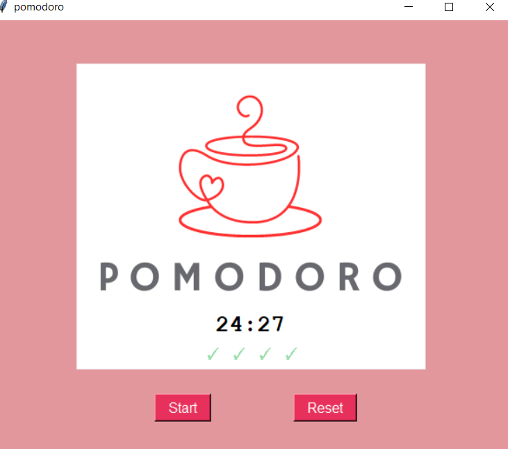

# Tkinter Apps

This repository contains three apps built using the Tkinter GUI toolkit for Python. The apps are:

- Pomodoro App: A productivity tool that uses the Pomodoro technique to help you stay focused and improve your productivity. Set a timer for 25 minutes, and take a short break after each work session.

- Speed to Mile Converter: A simple app that converts the speed in kilometers per hour to miles per hour.

## Getting Started

To run any of the apps, you'll need to have Python 3 and the Tkinter library installed on your machine. You can check if you have Python installed by running the following command in your terminal: pip install tkinter

## Running the Apps

To run the apps, simply navigate to the directory containing the app you want to run, and run the corresponding Python file.

For example, to run the Pomodoro App, navigate to the `pomodoro` directory and run the following command: python pomodoroapp.py

The app will launch, and you can start using it right away!

## Contributing

If you would like to contribute to any of the apps, feel free to open an issue or submit a pull request. We welcome contributions of all kinds, from bug fixes to feature requests to documentation improvements.

## License

This repository is licensed under the MIT License. See the `LICENSE` file for details.

